# 🦠 THUNDER HACKATHON 3.0

# JS Virus Simulator

### A Node.js-based system reconnaissance and file management tool

> ⚠️ **Disclaimer:** This project is not a malicious virus. The hackathon title is **"Create a Virus in JS"**, but the requirements focus on gathering system information, displaying environment variables, and performing CRUD operations on code files. This project implements those requirements safely and securely using Node.js.

---

## 📖 Overview

## 🧬 Virus Simulation Concept

This project simulates the reconnaissance stage of malware by collecting host information such as operating system details, runtime information, environment variables, memory statistics, and user data.

It also includes a controlled payload module capable of performing CRUD operations on code files within a sandboxed workspace. Unlike real malware, all operations are restricted to the project environment and cannot access files outside the workspace.

The application can:

* Gather and display system information
* Display selected environment variables
* Perform CRUD operations on code files
* Generate workspace statistics
* Generate file hashes
* Search files inside the workspace
* Monitor system health
* Create workspace backups
* Export system reports
* Maintain command history


## 🎯 Project Objective

Build a JavaScript-based tool capable of:

✅ Gathering system information

✅ Displaying environment variables

✅ Performing CRUD operations on code files

✅ Providing workspace statistics

✅ Generating file hashes

✅ Creating workspace backups

✅ Tracking command history

✅ Monitoring system health


## ✨ Key Features

| Feature                 | Description                                                  |
| ----------------------- | ------------------------------------------------------------ |
| 🖥️ System Information  | Collect OS, CPU, Memory, Host, Runtime & Environment details |
| 📁 CRUD Operations      | Create, Read, Update, Delete and List code files             |
| 📊 Workspace Statistics | Analyze workspace size, file counts and extensions           |
| 🔐 File Hashing         | Generate SHA256 and MD5 hashes                               |
| 🔍 File Search          | Search files recursively inside workspace                    |
| ❤️ System Health        | Monitor CPU cores and memory usage                           |
| 📦 Backup System        | Create ZIP backups of workspace                              |
| 📝 Command History      | Track executed commands                                      |
| 📄 Report Generation    | Export system information reports                            |
| 🛡️ Security Protection | Sandbox, Path Traversal Protection & Extension Whitelisting  |


## 📋 Command Reference

| Command                                          | Description                        |
| ------------------------------------------------ | ---------------------------------- |
| `node index.js sysinfo`                          | Display system information         |
| `node index.js sysinfo --json`                   | Display system information in JSON |
| `node index.js sysinfo --save`                   | Save report to reports folder      |
| `node index.js create <file>`                    | Create a code file                 |
| `node index.js read <file>`                      | Read a file                        |
| `node index.js update <file>`                    | Update a file                      |
| `node index.js update <file> <content> --append` | Append content                     |
| `node index.js delete <file>`                    | Delete a file                      |
| `node index.js list`                             | List workspace files               |
| `node index.js stats`                            | Workspace statistics               |
| `node index.js stats --json`                     | Statistics in JSON                 |
| `node index.js hash <file>`                      | Generate MD5 and SHA256 hashes     |
| `node index.js search <keyword>`                 | Search files                       |
| `node index.js health`                           | Display system health              |
| `node index.js backup`                           | Create workspace backup            |
| `node index.js history`                          | View command history               |


## 🔒 Security Features

### 🏠 Workspace Sandbox

All file operations are restricted to:

```text
workspace/
```

Files outside the workspace cannot be accessed.

---

### 🚫 Path Traversal Protection

Blocked Example:

```bash
node index.js read ../../package.json
```

Output:

```text
[ERROR] Path traversal blocked
```

---

### 🚫 Extension Whitelisting

Only approved code file extensions are allowed.

Blocked Example:

```bash
node index.js create virus.exe
```

Output:

```text
[ERROR] File extension ".exe" is not allowed
```

---

### 🛡️ Secure File Operations

* Prevents unauthorized filesystem access
* Restricts CRUD operations to workspace only
* Validates file extensions
* Handles invalid paths gracefully


## 📂 Folder Structure

```text
Hackathon03/
│
├── backups/
├── reports/
├── screenshots/
├── workspace/
│
├── lib/
│   ├── fileCRUD.js
│   ├── systemInfo.js
│   ├── stats.js
│   ├── hash.js
│   ├── search.js
│   ├── health.js
│   ├── backup.js
│   ├── zipUtil.js
│   ├── history.js
│   ├── report.js
│   └── ui.js
│
├── .history.json
├── index.js
└── README.md
```


## 🏗️ Architecture Diagram

```text
                index.js
                    │
 ┌──────────────────┼──────────────────┐
 │                  │                  │
 ▼                  ▼                  ▼

systemInfo.js    fileCRUD.js       history.js
     │                │
     │                │
     ▼                ▼

 report.js       workspace/

     │
     ▼

 reports/

------------------------------------------

 stats.js
 hash.js
 search.js
 health.js
 backup.js
 zipUtil.js

          │
          ▼

       workspace/

          │
          ▼

       backups/
```


## 🔄 Code Flow

### System Information Flow

```text
User Command
      │
      ▼
node index.js sysinfo
      │
      ▼
systemInfo.js
      │
      ▼
Display Report / JSON / Save Report
```

### CRUD Flow

```text
User Command
      │
      ▼
index.js
      │
      ▼
fileCRUD.js
      │
      ▼
workspace/
```

### Backup Flow

```text
workspace/
      │
      ▼
backup.js
      │
      ▼
zipUtil.js
      │
      ▼
backups/
```

# 📁 CRUD Operations Demonstration

The hackathon requires support for CRUD operations on code files.

The following screenshots demonstrate:

* Create File
* Read File
* Update File
* Append Content
* List Files
* Delete File
* Verify Deletion

---

## ✅ Create & Read Operation

Command:

```bash
node index.js create hackathon-test.js "console.log('Thunder Hackathon');"

node index.js read hackathon-test.js
```

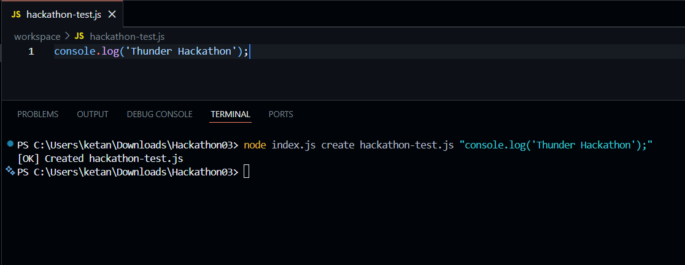
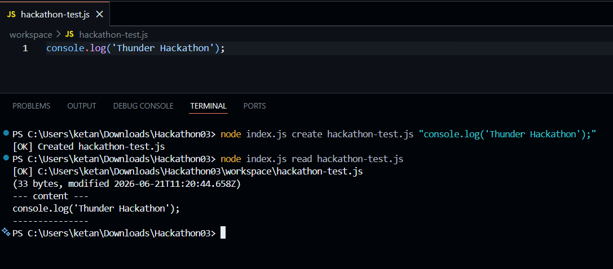

---

## ✅ Update & Append Operation

Commands:

```bash
node index.js update hackathon-test.js "console.log('Updated Content');"

node index.js update hackathon-test.js "console.log('Second Line');" --append

node index.js read hackathon-test.js
```

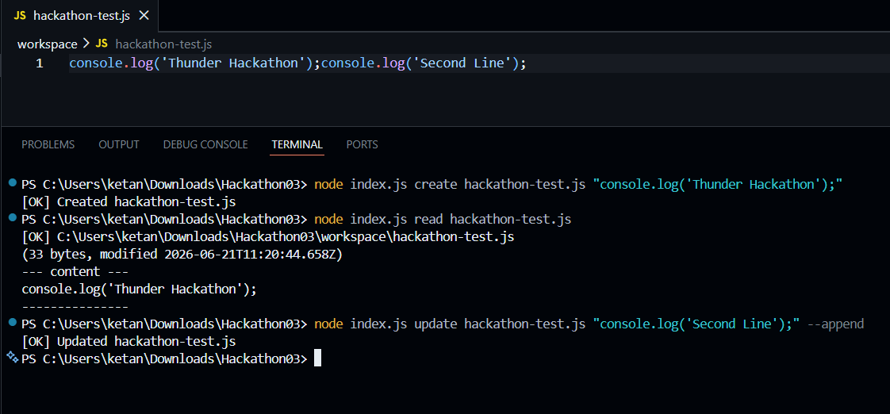

---

## ✅ Delete & Verification

Commands:

```bash
node index.js delete hackathon-test.js

node index.js read hackathon-test.js
```

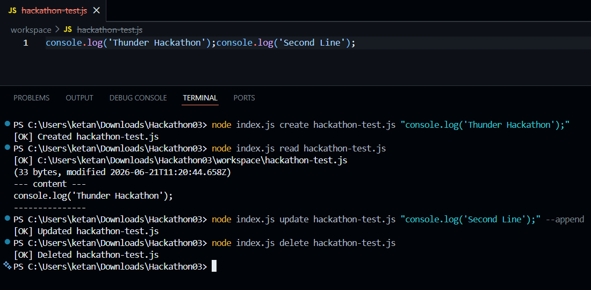


## 📸 Screenshots

### 📊 Workspace Statistics

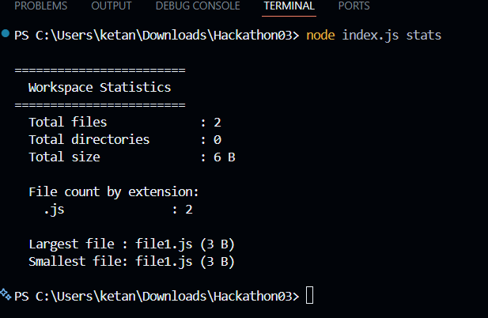

---

### 🔐 File Hashing

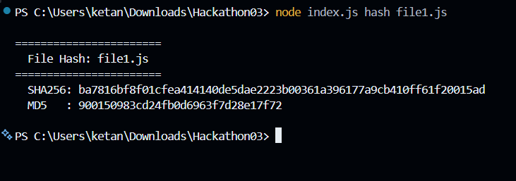

---

### ❤️ System Health

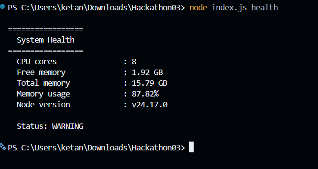

---

### 📦 Backup Creation

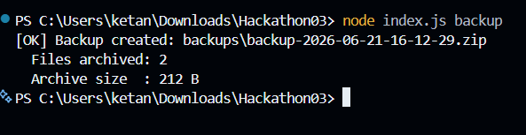

---

### 📄 System Report Generation

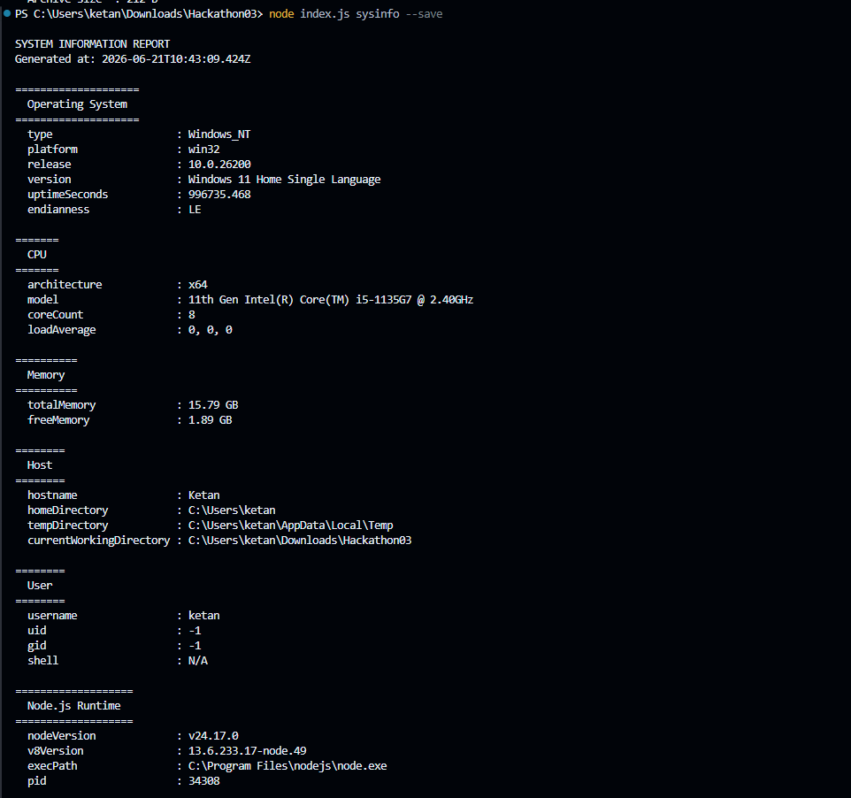

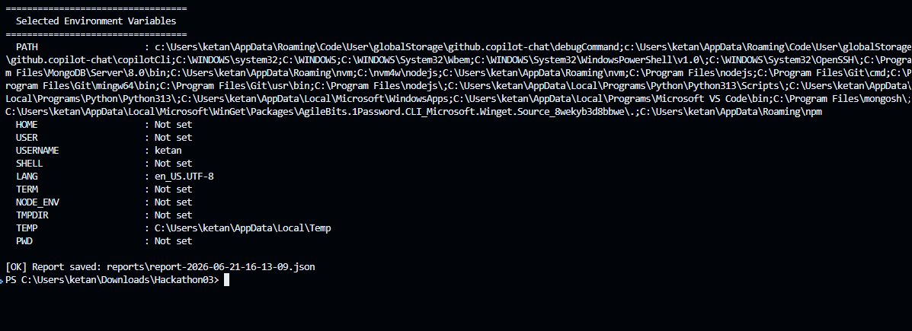

---

### 📝 Command History

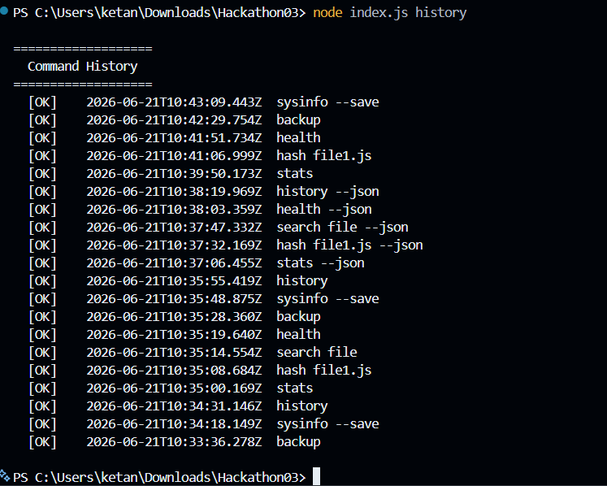


## 🛠️ Technologies Used

* JavaScript (Node.js)
* File System Module (`fs`)
* Path Module (`path`)
* OS Module (`os`)
* Crypto Module (`crypto`)

### External Dependencies

❌ No external npm libraries used

✅ Built entirely using Node.js built-in modules

---

## 🚀 Future Enhancements

* Recursive Directory Statistics
* Scheduled Backups
* Backup Restoration
* File Integrity Verification
* Export Reports to CSV
* Interactive CLI Menu

---

## 👨‍💻 Author

**Ketan Shetge**

Thunder Hackathon 3.0 Submission

Built using JavaScript (Node.js) with a focus on:

* Security
* System Information Gathering
* File Management
* Error Handling
* Clean CLI Design
